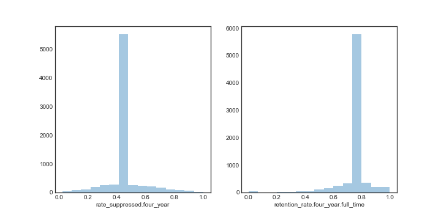
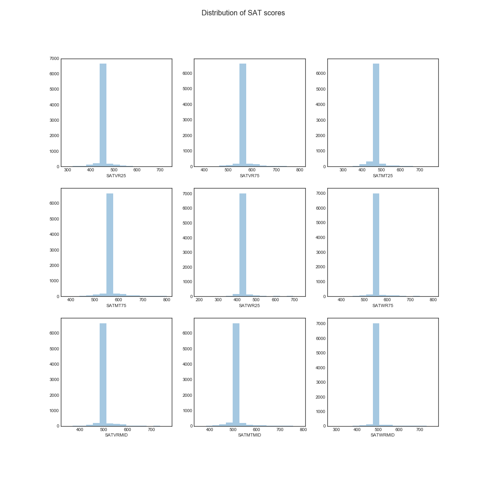
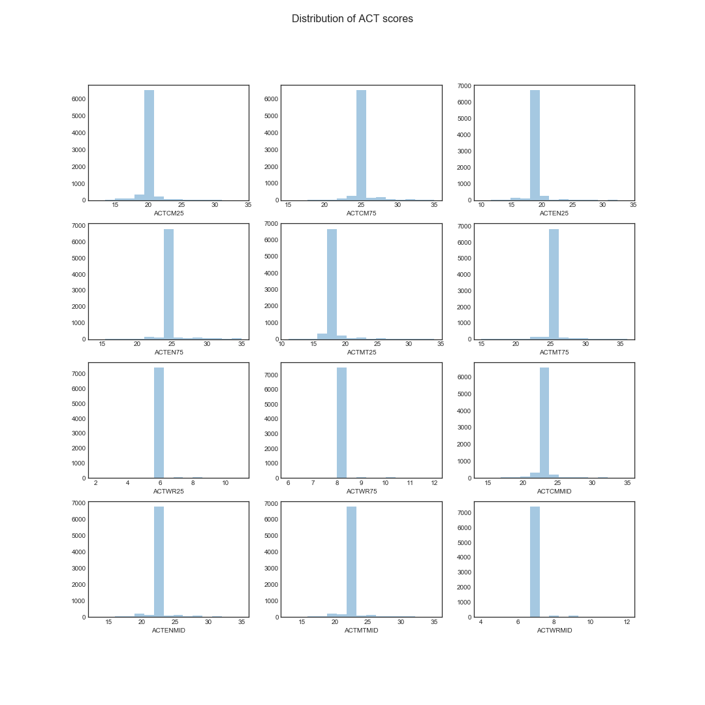
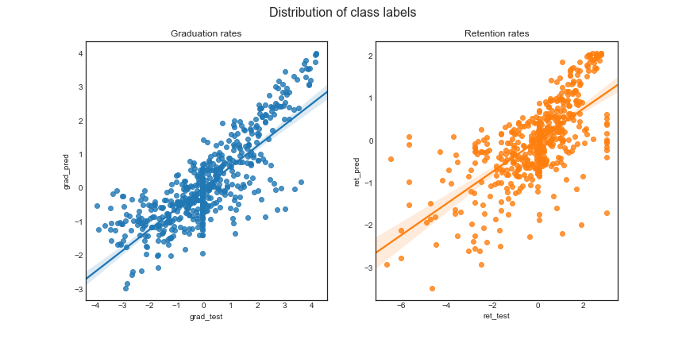
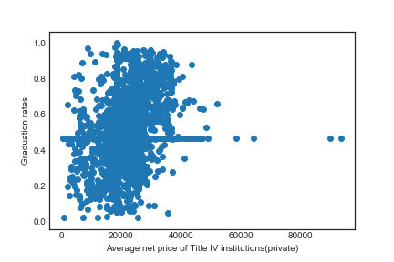
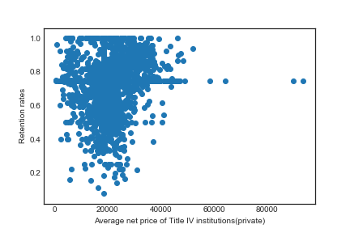
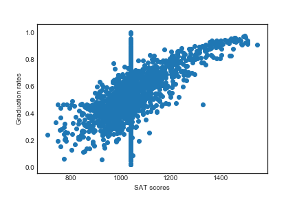
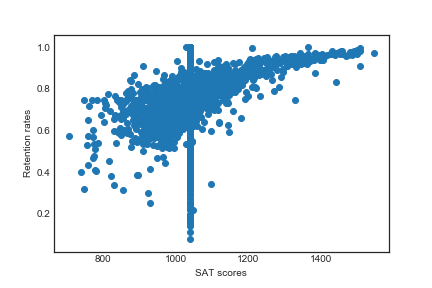

# Machine Learning Engineer Nanodegree

## Capstone Project

Sanjeev Yadav

9 April 2018

## Table of Contents

- [Definition](#def)
    - [Project Overview](#overview)
    - [Problem Statement](#problem)
    - [Metrics](#metrics)
- [Analysis](#analysis)
    - [Data Exploration](#explore)
    - [Exploratory visualization](#explore_vis)
    - [Algorithms and Techniques](#algo_techs)
    - [Benchmark](#benchmark)
- [Methodology](#method)
    - [Data Preprocessing](#pre-process)
    - [Implementation](#implement)
    - [Refinement](#refine)
- [Results](#res)
    - [Model Evaluation and Validation](#eval)
    - [Justification](#justify)
- [Conclusion](#conclusion)
    - [Free-Form visualization](#free-form-vis)
    - [Reflection](#reflection)
    - [Improvement](#improve)
- [References](#refs)

<a id='def'></a>

## I. Definition

<a id='overview'></a>

### Project Overview

Supervised learning is one of the most popular areas of machine learning in which much
development has already taken place. In this project we are trying to identify the university-level
factors which predict the presence of a strong retention and graduation rate. As the leader of the
big data revolution, Google gathers information through clicks on the Internet and uses this
information to personalize advertising to individual users<sup>[[1]](#ref1)</sup>. Previously, machine learning has been used in predicting the retention and graduation rates by using data sets of different US colleges. Student data consisted of two types of information: demographic information of student and transcripts<sup>[[2]](#ref2)</sup>. In fact, it is believed that 50-60% of students entering US colleges intending to major in a **STEM** field ultimately either graduate with a **non-STEM** degree or do not graduate at all<sup>[[3]](#ref3)</sup>.

The link to the data source is [here](https://github.com/sanjeevai/ML-Capstone). Name of the file is data.csv.
Data was collected from [data.gov](https://catalog.data.gov/dataset/college-scorecard), but for ease of access we have downloaded it and pushed it to this repository.

<a id='problem'></a>

### Problem Statement

One of the most pressing issues facing American universities is the number of students who fail to graduate. Nearly one out of five four-year institutions graduate fewer than one-third of its first-time, full-time degree-seeking first-year students within six years. Although there are various explanations for attrition, we will try to identify the most important feature which affects the retention and graduation rates in 4-year institutions.

We have two target variables:

1. Graduation rate, and
2. Retention rate

Both are continuous variable so this is a regression task. We will train same regression models for both target variables but the final model will be chosen based on the `r2_score`. It may be the case that one model performs better for graduation rate and another model for retention rate.

<a id='metrics'></a>

### Metrics

We will use [`r2_score`](https://scikit-learn.org/stable/modules/generated/sklearn.metrics.r2_score.html) as the metric for performance of our model. In statistics, the coefficient of determination, denoted R2 or r2 and pronounced "R squared", is the proportion of the variance in the dependent variable that is predictable from the independent variable(s)<sup>[[4]](#ref4)</sup>. It provides a measure of how well observed outcomes are replicated by the model, based on the proportion of total variation of outcomes explained by the model<sup>[[5]](#ref5)[[6]](#ref6)[[7]](#ref7)</sup>.

r2 = 1 - (RSS/TSS)

here:

**RSS (Residual Sum of Squares)** = sum of squares of difference between actual values(yi) and predicted values(yi^);

**TSS (Total Sum of Squares)** = sum of squares of difference between actual values (yi) and mean value (Before applying Regression).

So you can imagine TSS representing the **best** (actual) model, and RSS being **in between** our best model and the worst absolute mean model in which case we'll get RSS/TSS less than 1. If our model is even worse than the worst mean model then in that case RSS > TSS(Since difference between actual observation and mean value is less than the difference between predicted value and actual observation)<sup>[[8]](#ref8)</sup>.

`r2_score` is a good metric for this problem because this is a regression problem and `r2_score` can provide a clear understanding of a regression model's performance by comparing the predicted value with true value in the simplest way.

In our problem we have 2 target variables, both continuous and scaled using `StandardScaler` function from sklearn. So, `r2_score` is a fit metric for this problem.

<a id='analysis'></a>

## II. Analysis

<a id='explore'></a>

### Data Exploration

Name of the input data file is data.csv. It has 7593 observations and 123 variables.

Information about all the variables can be seen in _metadata.xlsx_ file. Let us discuss the variable in our input data.

#### Features(117)

1. **UNITID**: Unit ID for institution

2. **OPEID**: 8-digit OPEID ID for institution

3. **OPEID6**: 6-digit OPEID for institution

4. **INSTNM**: Institution name

5. **CITY**: city

6. **STABBR**: State postcode

7. **INSTURL**: URL for instution's homepage

8. **NPCURL**: URL for institution's net price calculator

9. **HCM2**: Schools that are on Heightened Cash Monitoring 2 by the Department of Education

10. **PREDDEG**: Predominant undergraduate degree awarded. Can take 5 values:

    1. Not classified
    2. Predominantly certificate-degree granting
    3. Predominantly associate's-degree granting
    4. Predominantly bachelor's-degree granting
    5. Entirely graduate-degree granting

11. **HIGHDEG**: Highest degree awarded. Can take 5 values:

    1. Non-degree-granting
    2. Certificate degree
    3. Associate degree
    4. Bachelor's degree
    5. Graduate degree

12. **CONTROL**: Control of institution. Can take 3 values:

    1. Public
    2. Private non-profit
    3. Private for-profit

13. **LOCALE**: Locale of institution. Can take 12 values:

    1. City: Large (population of 250,000 or more)
    2. City: Midsize (population of at least 100,000 but less than 250,000)
    3. City: Small (population less than 100,000)
    4. Suburb: Large (outside principal city, in urbanized area with population of 250,000 or more)
    5. Suburb: Midsize (outside principal city, in urbanized area with population of at least 100,000 but less than 250,000)
    6. Suburb: Small (outside principal city, in urbanized area with population less than 100,000)
    7. Town: Fringe (in urban cluster up to 10 miles from an urbanized area)
    8. Town: Distant (in urban cluster more than 10 miles and up to 35 miles from an urbanized area)
    9. Town: Remote (in urban cluster more than 35 miles from an urbanized area)
    10. Rural: Fringe (rural territory up to 5 miles from an urbanized area or up to 2.5 miles from an urban cluster)
    11. Rural: Distant (rural territory more than 5 miles but up to 25 miles from an urbanized area or more than 2.5 and up to 10 miles from an urban cluster)
    12. Rural: Remote (rural territory more than 25 miles from an urbanized area and more than 10 miles from an urban cluster)

14. **HBCU**: Flag for historically Black College and University.

15. **PBI**: Flag for predominantly black institution.

16. **ANNHI**: Flag for Alaska Native Native Hawaiian serving institution.

17. **TRIBAL**: Flag for tribal college and university

18. **AANAPII**: Flag for Asian American Native American Pacific Islander-serving institution

19. **HSI**: Flag for Hispanic-serving institution

20. **NANTI**: Flag for Native American non-tribal institution

21. **MENONLY**: Flag for men-only college

22. **WOMENONLY**: Flag for women-only college

23. **RELAFFIL**: Religious affiliation of the institution. It can take 65 values:

    1. Not reported
    2. Not applicable
    3. American Evangelical Lutheran Church
    4. African Methodist Episcopal Zion Church
    5. Assemblies of God Church
    6. Brethren Church
    7. Roman Catholic
    8. Wisconsin Evangelical Lutheran Synod
    9. Christ and Missionary Alliance Church
    10. Christian Reformed Church
    11. Evangelical Congregational Church
    12. Evangelical Covenant Church of America
    13. Evangelical Free Church of America
    14. Evangelical Lutheran Church
    15. International United Pentecostal Church
    16. Free Will Baptist Church
    17. Interdenominational
    18. Mennonite Brethren Church
    19. Moravian Church
    20. North American Baptist
    21. Pentecostal Holiness Church
    22. Christian Churches and Churches of Christ
    23. Reformed Church in America
    24. Episcopal Church, Reformed
    25. African Methodist Episcopal
    26. American Baptist
    27. American Lutheran
    28. Baptist
    29. Christian Methodist Episcopal
    30. Church of God
    31. Church of Brethren
    32. Church of the Nazarene
    33. Cumberland Presbyterian
    34. Christian Church (Disciples of Christ)
    35. Free Methodist
    36. Friends
    37. Presbyterian Church (USA)
    38. Lutheran Church in America
    39. Lutheran Church - Missouri Synod
    40. Mennonite Church
    41. United Methodist
    42. Protestant Episcopal
    43. Churches of Christ
    44. Southern Baptist
    45. United Church of Christ
    46. Protestant, not specified
    47. Multiple Protestant Denomination
    48. Other Protestant
    49. Jewish
    50. Reformed Presbyterian Church
    51. United Brethren Church
    52. Missionary Church Inc
    53. Undenominational
    54. Wesleyan
    55. Greek Orthodox
    56. Russian Orthodox
    57. Unitarian Universalist
    58. Latter Day Saints (Mormon Church)
    59. Seventh Day Adventists
    60. The Presbyterian Church in America
    61. Other (none of the above)
    62. Original Free Will Baptist
    63. Ecumenical Christian
    64. Evangelical Christian
    65. Presbyterian

24. **SATVR25**: 25th percentile of SAT scores at the institution (critical reading)

25. **SATVR75**: 75th percentile of SAT scores at the institution (critical reading)

26. **SATMT25**: 25th percentile of SAT scores at the institution (math)

27. **SATMT75**: 75th percentile of SAT scores at the institution (math)

28. **SATWR25**: 25th percentile of SAT scores at the institution (writing)

29. **SATWR75**: 75th percentile of SAT scores at the institution (writing)

30. **SATVRMID**: Midpoint of SAT scores at the institution (critical reading)

31. **SATMTMID**: Midpoint of SAT scores at the institution (math)

32. **SATWRMID**: Midpoint of SAT scores at the institution (writing)

33. **ACTCM25**: 25th percentile of the ACT cumulative score

34. **ACTCM75**: 75th percentile of the ACT cumulative score

35. **ACTEN25**: 25th percentile of the ACT English score

36. **ACTEN75**: 75th percentile of the ACT English score

37. **ACTMT25**: 25th percentile of the ACT math score

38. **ACTMT75**: 75th percentile of the ACT math score

39. **ACTWR25**: 25th percentile of the ACT writing score

40. **ACTWR75**: 75th percentile of the ACT writing score

41. **ACTCMMID**: Midpoint of the ACT cumulative score

42. **ACTENMID**: Midpoint of the ACT English score

43. **ACTMTMID**: Midpoint of the ACT math score

44. **ACTWRMID**: Midpoint of the ACT writing score

45. **SAT_AVG**: Average SAT equivalent score of students admitted

46. **SAT_AVG_ALL**:Average SAT equivalent score of students admitted for all campuses rolled up to the 6-digit OPE ID

47. **PCIP01**: Percentage of degrees awarded in Agriculture, Agriculture Operations, And Related Sciences.

48. **PCIP03**: Percentage of degrees awarded in Natural Resources And Conservation.

49. **PCIP04**: Percentage of degrees awarded in Architecture And Related Services.

50. **PCIP05**: Percentage of degrees awarded in Area, Ethnic, Cultural, Gender, And Group Studies.

51. **PCIP09**: Percentage of degrees awarded in Communication, Journalism, And Related Programs.

52. **PCIP10**: Percentage of degrees awarded in Communications Technologies/Technicians And Support Services.

53. **PCIP11**: Percentage of degrees awarded in Computer And Information Sciences And Support Services.

54. **PCIP12**: Percentage of degrees awarded in Personal And Culinary Services.

55. **PCIP13**: Percentage of degrees awarded in Education.

56. **PCIP14**: Percentage of degrees awarded in Engineering.

57. **PCIP15**: Percentage of degrees awarded in Engineering Technologies And Engineering-Related Fields.

58. **PCIP16**: Percentage of degrees awarded in Foreign Languages, Literatures, And Linguistics.

59. **PCIP19**: Percentage of degrees awarded in Family And Consumer Sciences/Human Sciences.

60. **PCIP22**: Percentage of degrees awarded in Legal Professions And Studies.

61. **PCIP23**: Percentage of degrees awarded in English Language And Literature/Letters.

62. **PCIP24**: Percentage of degrees awarded in Liberal Arts And Sciences, General Studies And Humanities.

63. **PCIP25**: Percentage of degrees awarded in Library Science.

64. **PCIP26**: Percentage of degrees awarded in Biological And Biomedical Sciences.

65. **PCIP27**: Percentage of degrees awarded in Mathematics And Statistics.

66. **PCIP29**: Percentage of degrees awarded in Military Technologies And Applied Sciences.

67. **PCIP30**: Percentage of degrees awarded in Multi/Interdisciplinary Studies.

68. **PCIP31**: Percentage of degrees awarded in Parks, Recreation, Leisure, And Fitness Studies.

69. **PCIP38**: Percentage of degrees awarded in Philosophy And Religious Studies.

70. **PCIP39**: Percentage of degrees awarded in Theology And Religious Vocations.

71. **PCIP40**: Percentage of degrees awarded in Physical Sciences.

72. **PCIP41**: Percentage of degrees awarded in Science Technologies/Technicians.

73. **PCIP42**: Percentage of degrees awarded in Psychology.

74. **PCIP43**: Percentage of degrees awarded in Homeland Security, Law Enforcement, Firefighting And Related Protective Services.

75. **PCIP44**: Percentage of degrees awarded in Public Administration And Social Service Professions.

76. **PCIP45**: Percentage of degrees awarded in Social Sciences.

77. **PCIP46**: Percentage of degrees awarded in Construction Trades.

78. **PCIP47**: Percentage of degrees awarded in Mechanic And Repair Technologies/Technicians.

79. **PCIP48**: Percentage of degrees awarded in Precision Production.

80. **PCIP49**: Percentage of degrees awarded in Transportation And Materials Moving.

81. **PCIP50**: Percentage of degrees awarded in Visual And Performing Arts.

82. **PCIP51**: Percentage of degrees awarded in Health Professions And Related Programs.

83. **PCIP52**: Percentage of degrees awarded in Business, Management, Marketing, And Related Support Services.

84. **PCIP54**: Percentage of degrees awarded in History.

85. **DISTANCEONLY**: Flag for distance-education-only education

86. **UGDS**: Enrollment of undergraduate certificate/degree-seeking students

87. **UGDS_WHITE**: Total share of enrollment of undergraduate degree-seeking students who are white

88. **UGDS_BLACK**: Total share of enrollment of undergraduate degree-seeking students who are black

89. **UGDS_HISP**: Total share of enrollment of undergraduate degree-seeking students who are Hispanic

90. **UGDS_ASIAN**: Total share of enrollment of undergraduate degree-seeking students who are Asian

91. **UGDS_AIAN**: Total share of enrollment of undergraduate degree-seeking students who are American Indian/Alaska Native

92. **UGDS_NHPI**: Total share of enrollment of undergraduate degree-seeking students who are Native Hawaiian/Pacific Islander

93. **UGDS_2MOR**: Total share of enrollment of undergraduate degree-seeking students who are two or more races

94. **UGDS_NRA**: Total share of enrollment of undergraduate degree-seeking students who are non-resident aliens

95. **UGDS_UNKN**: Total share of enrollment of undergraduate degree-seeking students whose race is unknown

96. **PPTUG_EF**: Share of undergraduate, degree-/certificate-seeking students who are part-time 

97. **CURROPER**: Flag for currently operating institution, 0=closed, 1=operating

98. **NPT4_PUB**: Average net price for Title IV institutions (public institutions)

99. **NPT4_PRIV**: Average net price for Title IV institutions (private for-profit and nonprofit institutions)

100. **NPT41_PUB**: Average net price for \$0-$30,000 family income (public institutions)

101. **NPT42_PUB**: Average net price for \$30,001-$48,000 family income (public institutions)

102. **NPT43_PUB**: Average net price for \$48,001-$75,000 family income (public institutions)

103. **NPT44_PUB**: Average net price for \$75,001-$110,000 family income (public institutions)

104. **NPT45_PUB**: Average net price for \$110,000+ family income (public institutions)

105. **NPT41_PRIV**: Average net price for \$0-$30,000 family income (private for-profit and nonprofit institutions)

106. **NPT42_PRIV**: Average net price for \$30,001-$48,000 family income (private for-profit and nonprofit institutions)

107. **NPT43_PRIV**: Average net price for \$48,001-$75,000 family income (private for-profit and nonprofit institutions)

108. **NPT44_PRIV**: Average net price for \$75,001-$110,000 family income (private for-profit and nonprofit institutions)

109. **NPT45_PRIV**: Average net price for \$110,000+ family income (private for-profit and nonprofit institutions)

110. **PCTPELL**: Percentage of undergraduates who receive a Pell Grant

111. **PCTFLOAN**: Percent of all undergraduate students receiving a federal student loan

112. **UG25ABV**: Percentage of undergraduates aged 25 and above

113. **MD_EARN_WNE_P10**: Median earnings of students working and not enrolled 10 years after entry

114. **GT_25K_P6**: Share of students earning over $25,000/year (threshold earnings) 6 years after entry

115. **GRAD_DEBT_MDN_SUPP**: Median debt of completers, suppressed for n=30

116. **GRAD_DEBT_MDN10YR_SUPP**: Median debt of completers expressed in 10-year monthly payments, suppressed for n=30

117. **RPY_3YR_RT_SUPP**: 3-year repayment rate, suppressed for n=30

#### Target variables

For graduation rates we have two variables in our data. Let us see the difference between those two.

1. **rate_suppressed.four_year** : Completion rate for first-time, full-time students at four-year institutions (150% of expected time to completion) , pooled in two-year rolling averages and suppressed for small n size.  

2. **rate_suppressed.lt_four_year_150percent**: Completion rate for first-time, full-time students at less-than-four-year institutions (150% of expected time to completion), pooled in two-year rolling averages and suppressed for small n size

We will be making predictions for **4-year institutions**. So, our first target 
variable is **rate_suppressed.four_year**

For retention rates we have four variables in our data. Let us see the difference between them:

1. **retention_rate.four_year.full_time**: First-time, full-time student retention rate at four-year institutions.

2. **retention_rate.lt_four_year.full_time**: First-time, full-time student retention rate at less-than-four-year institutions.

3. **retention_rate.four_year.part_time**: First-time, part-time student retention rate at four-year institutions

4. **retention_rate.lt_four_year.part_time**: First-time, part-time student retention rate at four-year institutions

Retention rate is for full-time students and we are making predictions for 4-year institutions. So, our second target variable is **retention_rate.four_year.full_time**.

We have two response variables:

1. **rate_suppressed.four_year**: This follows a near normal distribution.
2. **retention_rate.four_year.full_time**: This follow a left skewed distribution with outliers to consider.



Some helpful insights which helped in feature selection:

1. There were 3 columns which have which could be used as identifiers. One of them(`OPEID6`) had 1994 duplicates. We decided to choose one of them as our unique identifier.

```python
for col in ['OPEID', 'OPEID6', 'UNITID']:
    print("Number of duplicates in {} is {}"\
          .format(col,df[col].duplicated().sum()))
```

    >> Number of duplicates in OPEID is 30
    >> Number of duplicates in OPEID6 is 1994
    >> Number of duplicates in UNITID is 0

1. There were two types of null values in our data. One was _NaN_ and other was "Privacy Suppressed".

2. For SAT and ACT scores we had 25 percentile, 75 percentile and mid-point values. Since all of them had same type of distribution, we decided to keep the mid-point values and remove the other percentiles to reduce the number of outliers. We could have removed mid-point values also, but then it would be unable to consider students' transcripts as a factor.





<a id='explore_vis'></a>

### Exploratory visualization

Distribution of class labels showed some interesting results. This is the distribution of the class variables before applying feature scaling:


There are outliers at 0.0 in distribution of retention rates. 53 observations have such value. We have to remove these entries because no U.S. college has zero retention rate. On an average retention rate is 71%<sup>[[9]](#ref9)</sup>. This information can be concluded from the distribution of retention rate.

<a id='algo_techs'></a>

### Algorithms and Techniques

We have one benchmark model and 5 other supervised regression models. Below is the explanation of each model:

1. Decision Trees (Benchmark Model)

After data preprocessing, we train the input data and the evaluation metric from this model was considered as the benchmark.

A decision tree is a flow-chart-like structure, where each internal (non-leaf) node denotes a test on an attribute, each branch represents the outcome of a test, and each leaf (or terminal) node holds a class label<sup>[[10]](#ref10)</sup>.

Here we have 2 dependent variable so we train our model 2 times.

2. AdaBoost Regressor

AdaBoost, short for Adaptive Boosting, is a machine learning algorithm formulated by Yoav Freund and Robert Schapire, who won the 2003 Gödel Prize for their work. AdaBoost is sensitive to noisy data and outliers. The individual learners can be weak, but as long as the performance of each one is slightly better than random guessing, the final model can be proven to converge to a strong learner.

3. Extra Trees Regressor

With respect to random forests, the method drops the idea of using bootstrap copies of the learning sample, and instead of trying to find an optimal cut-point for each one of the K randomly chosen features at each node, it selects a cut-point at random.

4. Gradient Boosting Regressor

Gradient boosting is a machine learning technique for regression and classification problems, which produces a prediction model in the form of an ensemble of weak prediction models, typically decision trees. It builds the model in a stage-wise fashion like other boosting methods do, and it generalizes them by allowing optimization of an arbitrary differentiable loss function.

5. Light GBM

Light GBM grows tree vertically while other algorithm grows trees horizontally meaning that Light GBM grows tree leaf-wise while other algorithm grows level-wise. It will choose the leaf with max delta loss to grow. When growing the same leaf, Leaf-wise algorithm can reduce more loss than a level-wise algorithm.

6. Random Forest Regressor

Random forests or random decision forests are an ensemble learning method for classification, regression and other tasks, that operate by constructing a multitude of decision trees at training time and outputting the class that is the mode of the classes (classification) or mean prediction (regression) of the individual trees. Random decision forests correct for decision trees' habit of overfitting to their training set.

<a id='benchmark'></a>

### Benchmark

We will consider benchmark model as the decision tree regressor. We will get the `r2_score` from this model. Then we will use other regression models to improve our score.

<a id='method'></a>

## III. Methodology

<a id='pre-process'></a>

### Data Preprocessing

We have many column which were unique for every observation. We will choose one of them as the identifier variable for each observation.

For SAT and ACT scores we have 25 percentile, 75 percentile and mid-point values.We will only use the midpoint values for calculation to avoid curse of dimensionality.

We have two columns for SAT Average: SAT_AVG and SAT_AVG_ALL. Since we have removed OPEID column, we will be using SAT_AVG column because it provides overall stats, rather than averages based on OPEID.

We have average net price for public and private institutions. We will remove the average price based on different family income levels and use the overall average net price for public and private institutions. We am removing columns related to family income levels because We don't that family income is a university level factor. This is a factor based on student level.

Now I am removing the **Categorical Columns ( dtype object )** which have many levels.

I am keeping categorical columns which have less than 10 levels.

`INSTNM`, `INSTURL` & `NPCURL` are identifiers for colleges in offline or online media and are not university level factors which affect education's status.

`STABBR`, `CITY` & `RELAFFIL` columns have been removed because they had too many levels to be considered.

Calling `.info()` method shows data type _"object"_ for last few columns. This is because some values in these columns are "**PrivacySuppressed**".

There are two types of invalid entries here. First is the `Nan` entry and another is `PrivacySuppressed`.

We will first convert `PrivacySuppressed` to null value and then replace all the null values accordingly.

After converting `PrivacySuppressed` to `NaN`, pandas still treats them as _object_ data type. Below is a table showing correct data type of these columns(from metadata.xlsx file):

| Column| Data type |
|------|------|
|MD_EARN_WNE_P10| integer|
|GT_25K_P6|float|
|GRAD_DEBT_MDN_SUPP|float|
|GRAD_DEBT_MDN10YR_SUPP|float|
|RPY_3YR_RT_SUPP|float|
|C150_L4_POOLED_SUPP|float|
|C150_4_POOLED_SUPP|float|

Converting `MD_EARN_WNE_P10` to integer data type will throw an error because NaN cannot be converted to integer.

So we will convert `MD_EARN_WNE_P10` to _float_ type.

Now we will handle the null values.

But before applying median imputation, we need to check for some other categorical columns which might be important for analysis. There are some categorical levels which cannot be ignored while building the model. Those columns are:

1. PREDDEG
2. HIGHDEG
3. CONTROL
4. LOCALE(contains 12 levels but I will reduce them to 4 levels)

We have created dummy variable for these columns.

Finally we renamed the variables to be user-friendly.

<a id='implement'></a>

### Implementation

We have the same training and testing features for all the models. I wanted to try the fundamental ones first, i.e., decision trees(benchmark model) and random forest and then some ensemble methods. 

Creating benchmark model was quite simple because I could not find any benchmark model in previous works in this field. So I decided to use a simple decision tree as my benchmark model.

```python

from sklearn.tree import DecisionTreeRegressor
mod = DecisionTreeRegressor(max_depth = 3, random_state = 0)

# model for graduation rates
mod_grad = mod.fit(X_train, grad_train)
mod_ret = mod.fit(X_train, ret_train)

# model for retention rates
grad_pred = mod_grad.predict(X_test)
ret_pred = mod_ret.predict(X_test)
```

The metrics obtained from the benchmark model are:

graduation rate  = 0.31

retention rate  = 0.20

Below are the other supervised learners that I used for predictions.

1. AdaBoost Regressor

Here is a snippet from `project.ipynb` showing the model's application:

```python
# training
from sklearn.ensemble import AdaBoostRegressor
mod = AdaBoostRegressor(random_state=0)

# predicting
mod_grad = mod.fit(X_train, grad_train)
mod_ret = mod.fit(X_train, ret_train)
grad_pred = mod_grad.predict(X_test)
ret_pred = mod_ret.predict(X_test)

# evaluating performance
print("r2_score for graduation rate is: ", r2_score(grad_test, grad_pred))
print("r2_score for retention rate is: ", r2_score(ret_test, ret_pred))
```

    >> r2_score for graduation rate is:  0.14279834219048693
    >> r2_score for retention rate is:  0.14629839470300132

r2_scores obtained from this model were:

graduation rate  = 0.14

retention rate  = 0.15

I was expecting AdaBoost model to work well because it gives more importance to weaker learners in each iteration. However, it did not happen because Adaboost works well for binary classification. It was initially developed for binary classification.

2. Extra Trees Regressor

Here is a snippet from `project.ipynb` showing its application:
```python
# training
from sklearn.ensemble import ExtraTreesRegressor
mod = ExtraTreesRegressor(max_depth=2, random_state = 0)

# predicting
mod_grad = mod.fit(X_train, grad_train)
mod_ret = mod.fit(X_train, ret_train)
grad_pred = mod_grad.predict(X_test)
ret_pred = mod_ret.predict(X_test)

# evaluating performance
print("r2_score for graduation rate is: ", r2_score(grad_test, grad_pred))
print("r2_score for retention rate is: ", r2_score(ret_test, ret_pred))
```

    >> r2_score for graduation rate is:  0.30403412161006504
    >> r2_score for retention rate is:  0.19995674945336428

r2_scores obtained from this model were:

graduation rate  = 0.31

retention rate  = 0.20

3. Gradient Boosting Regressor

Here is a snippet from `project.ipynb` showing the model's application:

```python
# training
from sklearn.ensemble import GradientBoostingRegressor
mod = GradientBoostingRegressor(max_depth = 2, random_state = 0)

# predicting
mod_grad = mod.fit(X_train, grad_train)
mod_ret = mod.fit(X_train, ret_train)
grad_pred = mod_grad.predict(X_test)
ret_pred = mod_ret.predict(X_test)

# evaluating performance
print("r2_score for graduation rate is: ", r2_score(grad_test, grad_pred))
print("r2_score for retention rate is: ", r2_score(ret_test, ret_pred))

```

    >> r2_score for graduation rate is:  0.4647416126059296
    >> r2_score for retention rate is:  0.35969042288064146

r2_scores obtained from this model were:

graduation rate  = 0.46

retention rate  = 0.36

Prior to performing hyperparameter tuning on any algorithm, this untuned model gave the best result for retention rates. This was one of models which was considered for further refinement.

Score on retention rate increased by 30% and a slight drop for graduation rates.

On the other hand, score for graduation rate was 0.63 when using large number of estimators. It was a difficult task to decide which GBR model to select for final comparison with Light GBM. So I decided to test the performance of Light GBM first and then make some valid conclusion.

4. Light GBM

```python
import lightgbm as lgb

# create dataset for lightgbm
lgb_ret_train = lgb.Dataset(X_train, ret_train)
lgb_ret_eval = lgb.Dataset(X_test, ret_test, reference=lgb_ret_train)
lgb_grad_train = lgb.Dataset(X_train, grad_train)
lgb_grad_eval = lgb.Dataset(X_test, grad_test, reference=lgb_grad_train)


# specify configurations as a dict
params = {
    'task': 'train',
    'boosting_type': 'gbdt',
    'objective': 'regression',
    'metric': {'l2', 'auc'},
    'num_leaves': 31,
    'learning_rate': 0.05,
    'feature_fraction': 0.9,
    'bagging_fraction': 0.8,
    'bagging_freq': 5,
    'verbose': 0,
}

# train
gbm_ret = lgb.train(params,
                lgb_ret_train,
                num_boost_round=20,
                valid_sets=lgb_ret_eval,
                early_stopping_rounds=5)

gbm_grad = lgb.train(params,
                lgb_grad_train,
                num_boost_round=20,
                valid_sets=lgb_grad_eval,
                early_stopping_rounds=5)
```

r2_scores obtained from this model were:

graduation rate  = 0.47

retention rate  = 0.21

This untuned model provided **best** result for retention rates. This was the second model which was chosen for further refinement.

5. Random Forest Regressor

```python
# training
from sklearn.ensemble import RandomForestRegressor
mod = RandomForestRegressor(max_depth=2, random_state=0)

# predicting
mod_grad = mod.fit(X_train, grad_train)
mod_ret = mod.fit(X_train, ret_train)
grad_pred = mod_grad.predict(X_test)
ret_pred = mod_ret.predict(X_test)

# evaluating performance
print("r2_score for graduation rate is: ", r2_score(grad_test, grad_pred))
print("r2_score for retention rate is: ", r2_score(ret_test, ret_pred))
```

    >> r2_score for graduation rate is:  0.31495810181665296
    >> r2_score for retention rate is:  0.19999357091743553

r2_scores obtained from this untuned model were:

graduation rate  = 0.31

retention rate  = 0.20

This untuned model provided poor results for both targets.

Here are the most challenging problems I faced in implementation (and prior to it):

- Deciding target variables

    For graduation rates we had 2 variables and for retention rates we had 4 variables. We had to apply certain constraints to narrow down the target space.

- GBR model

    The most challenging part of implementation was deciding which GBR model to consider for final comparison with Light GBM. Hyperparameter tuning decreased the score for graduation rates, whereas `n_estimators` adjustment provided good results for the same. Hyperparameter tuning of Light GBM surpassed the former for both target predictions. So, I decided to see the results of Light GBM first and then dropped the GBM model.

- Expected good score from AdaBoost

I got unexpected results for AdaBoost Regressor. I applied the same model in [supervised learning project](https://github.com/sanjeevai/Finding_Donors_For_CharityML) and got good results. Thorough research showed that AdaBoost was initially developed for binary classification and this is a regression task.

<a id='refine'></a>

### Refinement

Our benchmark model was decision tree regressor. For this model, `r2_score` for graduation rate was 0.31 and for retention rate was 0.20.

The final model which we chose was Light GBM. Initial r2 scores for this model were 0.81 for graduation rates and 0.66 for retention rates. We applied hyperparameter tuning by using `num_iteration=gbm.best_iteration_` for the model. Here `gbm` is our regressor model.

Final metrics were 0.83 for graduation rates and 0.57 for retention rates.

Here is the full process for hyperparameter tuning.

For graduation rates:

```python
from sklearn.model_selection import GridSearchCV

lgb_grad_train = lgb.Dataset(X_train, grad_train)
lgb_grad_eval = lgb.Dataset(X_test, grad_test, reference=lgb_grad_train)

print('Start training...')
# train
gbm = lgb.LGBMRegressor(objective='regression',
                        num_leaves=31,
                        learning_rate=0.05,
                        n_estimators=20)
gbm.fit(X_train, grad_train,
        eval_set=[(X_test, grad_test)],
        eval_metric='l1',
        early_stopping_rounds=5)

print('Start predicting...')
# predict
grad_pred = gbm.predict(X_test, num_iteration=gbm.best_iteration_)
# eval
print('The r2_score for graduation rate is:', r2_score(grad_test, grad_pred) ** 0.5)

# feature importances
print('Feature importances:', list(gbm.feature_importances_))

# other scikit-learn modules
estimator = lgb.LGBMRegressor(num_leaves=31)

param_grid = {
    'learning_rate': [0.01, 0.1, 1],
    'n_estimators': [20, 40]
}

gbm = GridSearchCV(estimator, param_grid)

gbm.fit(X_train, grad_train)

print('Best parameters found by grid search are:', gbm.best_params_)
```

    >> Best parameters found by grid search are: {'learning_rate': 0.1, 'n_estimators': 40}

For retention rates:

```python
lgb_ret_train = lgb.Dataset(X_train, ret_train)
lgb_ret_eval = lgb.Dataset(X_test, ret_test, reference=lgb_ret_train)

print('Start training...')
# train
gbm = lgb.LGBMRegressor(objective='regression',
                        num_leaves=31,
                        learning_rate=0.05,
                        n_estimators=20)
gbm.fit(X_train, ret_train,
        eval_set=[(X_test, ret_test)],
        eval_metric='l1',
        early_stopping_rounds=5)

print('Start predicting...')
# predict
ret_pred = gbm.predict(X_test, num_iteration=gbm.best_iteration_)
# eval
print('The r2_score for retention rate is:', r2_score(ret_test, ret_pred) ** 0.5)

# feature importances
print('Feature importances:', list(gbm.feature_importances_))

# other scikit-learn modules
estimator = lgb.LGBMRegressor(num_leaves=31)

param_grid = {
    'learning_rate': [0.01, 0.1, 1],
    'n_estimators': [20, 40]
}

gbm = GridSearchCV(estimator, param_grid)

gbm.fit(X_train, ret_train)

print('Best parameters found by grid search are:', gbm.best_params_)
```

    >> The best parameters obtained retention rates are: {'learning_rate': 0.1, 'n_estimators': 20}

<a id='res'></a>

## IV. Results

<a id='eval'></a>

### Model Evaluation and Validation

The final model was Light GBM. It was chosen for graduation rates only. But, when we applied hyperparameter tuning then it was proved to be the best model for retention rates also.

Below are parameters of the final model:

1. objective='regression'

This indicates that we are doing a regression problem.

2. num_leaves=31

It shows number of leaves in one tree

3. learning_rate=0.1

It is the learning rate of model

4. n_estimators=40

It is the number of trees to be used in the forest.

Now let us see the results of our final model:



This model shows relatively poor scores for retention rates because of the distribution of retention rates. This model could have performed better if retention rates were more normally distributed.

So why we choose Light GBM as our final model?

Some advantages of Light GBM over other models are:

1. **Faster training speed andhigher efficiency:**  Light GBM use histogram based algorithm i.e it buckets continuous feature values into discrete bins which fasten the training procedure.

2. **Lower memory usage:** Replaces continuous values to discrete bins which result in lower memory usage.

3. **Better accuracy than any other boosting algorithm:** It produces much more complex trees by following leaf wise split approach rather than a level-wise approach which is the main factor in achieving higher accuracy. However, it can sometimes lead to overfitting which can be avoided by setting the max_depth parameter<sup>[[11]](#ref11)</sup>.

4. **Compatibility with Large Datasets:** It is capable of performing equally good with large datasets with a significant reduction in training time as compared to XGBOOST<sup>[[11]](#ref11)</sup>.

5. **Parallel learning supported.**

<a id='justify'></a>

### Justification

Below is a comparision of performance of our final model and the benchmark model showing r2_scores for graduation and retention rates.

|Model|graduation rates|retention rates |
|------|------|------|
|Decision Tree Regressor(Benchmark model)|0.31|0.20|
|Light GBM(Final model)|0.81|0.66|

We have achieved good results in comparison to benchmark model. Now we will use `feature_importances` to see most relevant features.

<a id='conclusion'></a>

## V. Conclusion

<a id='free-form-vis'></a>

### Free-Form visualization

Let us see the relationship between the important features and target variables. Out of top 10 features for each target variable prediction, 8 were common. This helped me in analyzing the important factors in one go. Below are some scatterplots showing relationship between targets and important features:

- Financial criteria

4 out of 8 features were like financial aids, grants, debts, etc.

Below are some plots that give us an idea of how inability to pay debts causes dropping out of college.





Not a strong correlation but still we can see how rapidly graduation and retention rates change with education fees.

- Academics





Very strong correlation. This result was expected because present academic performance decides whether you continue your studies further or not.

- Demographics

<a id='reflection'></a>

### Reflection

We had 7593 observations and 123 variables. The toughest part was feature selection. We have used domain knowledge to remove features which we think are less important or are not university level factor.

One interesting aspect was that we had multiple target labels and we have to narrow down by applying certain conditions, like solving the problem for first-time full-time 4-year institutions.

My final model can be used for analyzing important features affecting graduation rates as it has a decent r2 score of 0.8. For retention rates, further improvement can be made as I could get r2 score of 0.6 after hyperparameter tuning.

<a id='improve'></a>

### Improvement

Further improvements can be made if we use hyperparameter tuning on the remaining models also. Maybe they will give better results than our final model.

We have not used XGBoost algorithm here. Maybe it can be used in further iteration to improve the results. I did not use XGBoost because I did not know in detail about its working.

If we consider our final solution as the new benchmark then I think better solutions exist because we have obtained r2 scores of 0.8 and 0.6 only. Atleast r2 scores for retention rate can be improved significantly.

<a id='refs'></a>

## VI. References

<a id="ref1"></a>

1. https://www.usnews.com/opinion/articles/2013/08/15/why-big-data-not-moocs-will-revolutionize-education

<a id="ref2"></a>

2. https://arxiv.org/pdf/1606.06364.pdf

<a id="ref3"></a>

3. https://arxiv.org/pdf/1708.09344.pdf

<a id="ref4"></a>

4. http://stattrek.com/statistics/dictionary.aspx?definition=coefficient_of_determination

<a id="ref5"></a>

5. Steel, R. G. D.; Torrie, J. H. (1960). Principles and Procedures of Statistics with Special Reference to the Biological Sciences. McGraw Hill.

<a id="ref6"></a>

6. Glantz, Stanton A.; Slinker, B. K. (1990). Primer of Applied Regression and Analysis of Variance. McGraw-Hill. ISBN 0-07-023407-8.

<a id="ref7"></a>

7. Draper, N. R.; Smith, H. (1998). Applied Regression Analysis. Wiley-Interscience. ISBN 0-471-17082-8.

<a id="ref8"></a>

8. https://stackoverflow.com/questions/23309073/how-is-the-r2-value-in-scikit-learn-calculated

<a id="ref9"></a>

9. https://www.collegefactual.com/colleges/united-states-university/academic-life/graduation-and-retention/

<a id="ref10"></a>

10.  https://en.wikipedia.org/wiki/Decision_tree_learning

<a id="ref11"></a>

11.  https://www.analyticsvidhya.com/blog/2017/06/which-algorithm-takes-the-crown-light-gbm-vs-xgboost/